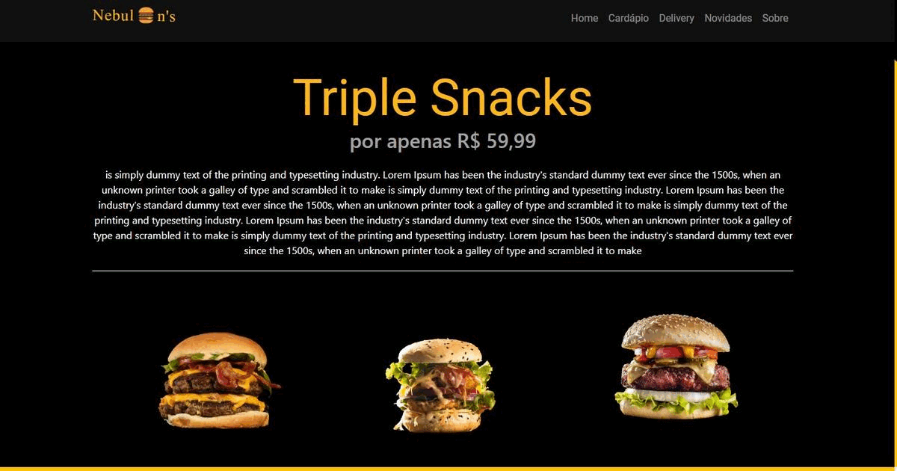

# Nebulon-s
 Web Nebulon's - hamburgueria 

 

<h4 align="center">
 hamburgueria 
</h4>

## Sobre 📖

Projeto chamado  Web Nebulon's - hamburgueria , ele foi desenvolvio para um cliente.
O projeto tem como objetivo motivar as pessoas a conhecerem o espaço  Web Nebulon's - hamburgueria  e experimentar um pouco do trabalho  que ele faz com  Todo tipo de lanches venha conhecer muitas variedades de laches.

## 🎨 Layout

## Site 💻

Conheça o site clicando em <a href="https://wandersondefariasprogramador.github.io/Projeto-haburgue/"> hamburgueria  </a>

Este projeto foi desenvolvido  por <a href="https://github.com/wandersondefariasprogramador"> @wandersonde 
farias </a>

<table>
  <tr>
     <td align="center">
      <a href="#">
         
        
          <b>wanderson de farias</b>
        
        
      </a>
      
     
    
   

    

